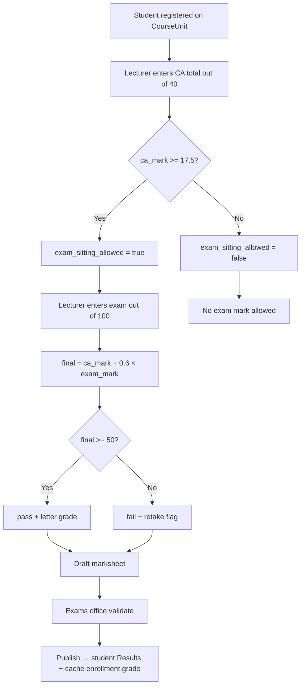

# Exam & results logic — comparison

**Purpose:** Compare **Ndejje rules (your legacy / Senate policy)**, **what other ERPs do**, and **what the NDU portal has today** — so the standalone `examinations` module is built on the right logic, not copied blindly.

**Status:** ARMS logic documented from Desktop `Active Solution` (§2). Optional: `inspect_arms_exams` on live DB for column-level confirmation.

---

## 1. At a glance

| Layer | What it defines | Ndejje / legacy (target) | OpenEduCat | Fedena | ERPNext Education | NDU portal **today** |
|-------|-----------------|--------------------------|------------|--------|-------------------|----------------------|
| **Weights** | CA / exam | **CA /40 + exam /100** (20+20 entered as one CA) | Per course template, multi criteria | Per exam group + subject weightages | Assessment criteria on plan | **None** |
| **Sit exam gate** | Min CA before exam | **CA &lt; 17.5** → no sit (same as legacy threshold on /40 scale) | Often min per component / session rules | Gradebook + exam connect | Plan + criteria | **None** |
| **Final mark** | Formula | `ca_mark + 0.6 × exam_mark` | Weighted criteria → total | Weighted components | Criteria weights → grade | **None** (only empty `grade` on enrollment) |
| **Pass** | Threshold | **≥ 50%** | Configurable | Pass marks on gradebook | Grading scale | **None** |
| **Retake** | Fail path | Fail → retake (fee head exists) | Re-exam / back paper flows | Exam retake links | New assessment / course | **Status `failed` on enrollment only** — no mark workflow |
| **Letter grade** | A–F bands | Senate scale | Grade template | Gradebook grades | Grading scale | **None** |
| **Who enters marks** | Lecturer | Per course / unit | Faculty on marksheet | Teacher gradebook | Instructor / bulk tool | **Placeholder UI only** |
| **Publish** | Student sees results | After Senate / exams office | Validate → publish marksheet | Submit → lock gradebook | Submit result | **None** |
| **Exam session** | When/where | ARMS / exams office (TBD) | Exam session + hall ticket | Exam schedule + connect | Assessment plan schedule | **None** |
| **Eligibility (admin)** | Fees, revoke, enroll | Revoked / not enrolled / no SPE | Enrollment on session | Student batch + fees | Student group | **Lifecycle rules in admissions doc; not wired to marks** |

---

## 2. Legacy (ARMS v2) — from `Active Solution` on your Desktop

**Source path:** `C:\Users\JOSH\Desktop\New folder (3)\Active Solution\`

| Folder | What it is |
|--------|------------|
| **`armsv2/`** | Ndejje **ARMS** web app (ASP.NET MVC views + JS). Database: **`arms_v2`**. |
| **`GraduationModule/`** | SQL migrations for graduation + publish reset (same DB). |
| **`ScriptsToRunOnServerBackup/`** | Grading scheme, exemptions, `student_course` fixes. |

> **Note:** This copy has **views/JS/SQL only** — no `.cs` controllers. Calculation rules live in compiled `ARMSv2.Core` (not in this folder). UI + SQL still show the real data model and workflow.

### ARMS per-course marks (core exams logic)

**Table:** `student_course` (see `ScriptsToRunOnServerBackup/UpdateStudentCourseSemLevel.sql`)

**Fields used in UI** (`Views/Result/_SemesterResultDetail.cshtml`, `_EditStudentCourse.cshtml`):

| Field | Shown as | Entry |
|-------|---------|--------|
| `ContinousAssessment` | **CA (/40)** | Lecturer text box |
| `ExaminationMark` / `ExamMark` | **Exam Mark (/100)** | Lecturer text box |
| `FinalMark` | **Total Mark** | Computed server-side (not typed in edit form) |
| `CourseScoreSummary.GradePoint` | GP | From `grading_schema` |
| `CourseScoreSummary.Grade` | Letter | Student view |
| `CourseScoreSummary.HasNoProblem` | — | Rows with problems hidden or highlighted (eligibility / validation) |

**Portal decision:** Same as ARMS — **one CA (/40)** for the combined 20% test + 20% coursework total; **exam (/100)**. Senate still treats assessment as 20+20+60; lecturers do not enter test and coursework separately.

**Formula (aligned with ARMS):**

```
FinalMark ≈ ContinousAssessment + (ExamMark × 0.60)   // when CA is 0–40 and exam is 0–100
```

Pass / sit-exam rules are enforced in `CourseScoreSummary.HasNoProblem` (C# not in this copy) — often minimum CA before exam (e.g. 12/40).

### ARMS result workflow (matches Fedena/OEC “draft → publish”)

| `ResultStatus` (enum) | Meaning |
|------------------------|---------|
| `NoMarks` | Not entered |
| `MarksEntered` | Lecturer saved; **pending publish** |
| `PublishedMarks` | Official; student can see |
| `ChangedPendingApproval` | Edit after publish → needs approval |
| `DeletedPendingApproval` | Delete after publish → needs approval |

**Publish:** `published_result` table (`isPublished`, `publishedBy`, `publishedOn`) — bulk publish per campus/program/course/semester (`PublishResult.cshtml`, `results.js`).

**Changes after publish:** `result_approval` stores `oldContinuousAssessment`, `oldExamMark`, `oldFinalMark` → `new*` (`updateResultApproval_addColumns.sql`).

### ARMS grading & progression

| Piece | Purpose |
|-------|---------|
| `grading_scheme` + `grading_schema` | Letter grades (`gradeLetter`, `gradePoint`, `startMark`/`endMark` bands) per award type + academic year |
| `result_calculation` / CGPA formula | Year 1–N **percentage contributions** to final CGPA (`EditResultCalculation.cshtml`) |
| `student.currentCTCU`, `currentCGPA`, `currentAward` | Cached after publish (`GraduationModule` SQL) |

### ARMS graduation module (`GraduationModule/`)

| Table / field | Purpose |
|---------------|---------|
| `graduation_ceremony` | Ceremony name, completion date, `showTranscriptMarks` |
| `graduation_detail` | Graduation day under a ceremony |
| `student.graduationDetailId` | Links student to graduation event |
| `student.studentStatus = 11` | Graduated (reset scripts set back to `0`) |
| `published_result` reset | Unpublish all (`7_update_PublishedResultTable_ResetAll.sql`) |

Graduation **reads** published marks; it does not replace the Results module. Full graduation UI/workflow: **`GRADUATION_LEGACY_ARMS.md`** (`armsv2/Views/Graduation`).  
Full results UI/workflow: **`RESULT_LEGACY_ARMS.md`** (`armsv2/Views/Result`).  
Policy / grading config: **`SEMESTER_LEGACY_ARMS.md`** (`armsv2/Views/Semester`).

### Ndejje rules for the **new portal** — **agreed (2026-05-20)**

Same **40/60** entry as legacy ARMS. Lecturers enter **one CA total** (test 20% + coursework 20% combined), not two fields.

```
ca_mark           = single lecturer entry (0–40)   // combined test + coursework
exam_eligible     = ca_mark >= 17.5
exam_mark         = 0–100 (only if exam_eligible)
final_mark        = ca_mark + (exam_mark × 0.60)
pass              = final_mark >= 50
```

**Worked example**

| CA (/40) | Sit exam? | Exam (/100) | Final | Pass? |
|----------|-----------|-------------|-------|-------|
| 18.0 | Yes | 55 | 18 + 33 = **51** | Yes |
| 14.0 | **No** | — | — | Block exam entry |
| 20.0 | Yes | 40 | 20 + 24 = **44** | Fail / retake |

*(If a student scored test 40% and coursework 50% internally, the lecturer would enter CA = 0.2×40 + 0.2×50 = **18** on the /40 scale.)*

### Typical ARMS-style patterns (confirm with inspect)

Most campus SIS products like ARMS usually have:

- Marks per **student × course × semester** (sometimes per exam sitting)
- Components: continuous assessment + end-of-semester exam
- **Registration** gate: only registered students get marks
- **Programme / batch** scoping (maps to portal `ProgramBatch` + `CourseUnit`)
- Student key: reg number (maps to `AdmittedStudent.reg_no`)

**Gap until inspect:** exact table names, whether ARMS uses 20/20/60 in DB or only in UI, retake as new row vs overwrite, and whether publish is a flag or separate table.

---

## 3. Other ERPs — logic we studied (workflows to borrow, not copy)

### OpenEduCat

| Logic | Behaviour |
|-------|-----------|
| Structure | **Course** → assessment types (criteria) with weights |
| Entry | Faculty enters marks per student per criterion on **marksheet** |
| Exam sitting | **Exam session** (date, room), optional **hall ticket** |
| Gate | Session/enrollment rules; criteria can be mandatory before exam |
| Publish | **Validate** marksheet → **publish** (students see official results) |
| Compare to Ndejje | Same **multi-component + weights + publish** idea; weights are **per course template**, not globally 20/20/60 unless you configure each course that way |

**Pick for NDU:** marksheet grid per course unit; validate → publish; optional exam session later.

### Fedena

| Logic | Behaviour |
|-------|-----------|
| Structure | **Gradebook** per subject/class; link **exams** with **weightages** |
| Entry | Teacher enters → **save** → **submit** |
| Lock | Admin **lock/unlock** gradebook (controls edits) |
| Compare to Ndejje | **Submit/lock** maps well to “lecturer finished → exams office publishes”; weightages map to 20/20/60 if configured once per programme |

**Pick for NDU:** draft marks → submit → lock; per-class (course unit) gradebook for lecturers.

### ERPNext Education

| Logic | Behaviour |
|-------|-----------|
| Structure | **Assessment plan** (schedule) + **assessment criteria** (weights) |
| Entry | Marks per criterion; **bulk** result tools |
| Compare to Ndejje | Strong on **policy definition** (criteria weights) and **scheduling**; less on “17.5 cannot sit” unless custom |

**Pick for NDU:** `AssessmentPolicy` model (weights + sit threshold + pass mark); optional assessment plan in Phase 2.

### Uganda / NCHE context (reference only)

Many Ugandan universities document roughly **40% CA / 60% exam** and a **minimum CA to sit** (e.g. 12/40). Ndejje’s **20+20+60 with 17.5 gate** is stricter and **must stay configurable** in policy — do not hard-code NCHE defaults.

---

## 4. NDU portal today — what exists vs what’s missing

### Have (foundation for exams)

| Piece | Use for exams |
|-------|----------------|
| `StudentCourseUnitEnrollment` | **Who** is on a unit; `registration_date` / `is_registered` = sat for course |
| `CourseUnit` + `Semester` + `ProgramBatch` | **Scope** marks and results |
| `StudentProgrammeEnrollment` | Programme-level status (enrolled, detained, …) |
| `AdmittedStudent` + revoke flow | **Block** revoked students |
| `payments.FeeHead` code `exam` | Retake / exam fees |
| Horizon routes | `EnterScores`, `Results` (placeholders) |
| `examinations` app shell | `/api/examinations/` ready |

### Do not have (examinations module must add)

| Missing | ERP that shows the pattern |
|---------|----------------------------|
| CA + exam marks (CA single field /40) | ARMS + all ERPs |
| `exam_eligible` / block exam entry | Ndejje-specific; Fedena/OEC have softer gates |
| Computed `final_mark`, letter grade | All three |
| Publish workflow | OEC validate/publish; Fedena lock |
| Lecturer enter API + permissions | All three |
| GPA / transcript | OEC / ERPNext later phase |
| ARMS import | Legacy only |

### Explicit deferral in code

`StudentAcademicTrackerView` and `course_enrollment_views` state that **GPA, grades, and exam results are a later phase** — that phase is the `examinations` app, not an extension inside `Programs`.

`StudentCourseUnitEnrollment.grade` should become a **cached published letter** (or numeric), not the source of truth for calculation.

---

## 5. Recommended unified logic for NDU `examinations`

One **policy engine** (Ndejje defaults), **Fedena-style** entry lock, **OpenEduCat-style** publish:



| Step | Source |
|------|--------|
| CA/40 + exam/60, 17.5 sit rule, 50% pass | **Ndejje / ARMS legacy** |
| Per-unit marksheet, components | **OpenEduCat** |
| Draft → submit → lock | **Fedena** |
| `AssessmentPolicy` + optional schedule | **ERPNext** |
| Enrollment + revoke + exam fee | **NDU portal already** |

---

## 6. What to do next

1. Run **`inspect_arms_exams`** on production/staging ARMS and update §2 with real tables + sample row.
2. Confirm with Senate: **17.5** rule and any **minimum exam paper** mark.
3. Implement Phase 1 in `examinations`: policy + components + calculator + lecturer enter + publish.

---

## 7. ARMS → portal mapping (from Desktop legacy)

| ARMS (`arms_v2`) | Portal (`examinations` + `Programs`) |
|------------------|--------------------------------------|
| `student` | `AdmittedStudent` (`reg_no` ↔ `RegistrationNumber`) |
| `student_course` | `StudentCourseUnitEnrollment` + assessment/result rows |
| `ContinousAssessment` | `ca_mark` (0–40, combined 20+20) |
| `ExamMark` | `exam` component |
| `FinalMark` | `CourseUnitResult.final_mark` |
| `grading_schema` | `GradeScale` / `GradeBand` |
| `published_result` | `ResultPublication` |
| `result_approval` | Post-publish change audit |
| `graduation_*` | Graduation phase (uses published marks + CGPA) |

---

## 8. Document history

| Date | Note |
|------|------|
| 2026-05-20 | Initial comparison (legacy policy + ERP + portal gap) |
| 2026-05-20 | ARMS legacy from Desktop `Active Solution` (armsv2 + GraduationModule) |
| 2026-05-20 | Agreed policy: single CA /40 (20+20 combined), exam /100, sit if CA ≥ 17.5 |
