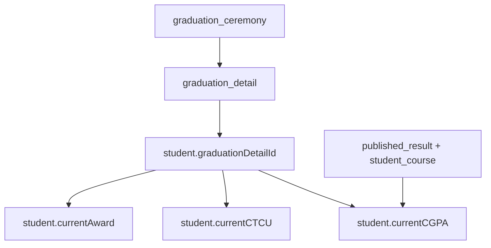

# Graduation module — legacy ARMS (`armsv2/Views/Graduation`)

**Source:** `C:\Users\JOSH\Desktop\New folder (3)\Active Solution\armsv2\Views\Graduation`  
**Database:** `arms_v2` (same as Results)  
**Relationship:** Graduation **consumes** published marks and cached **CGPA / CTCU**; it does not enter or calculate course marks.

---

## 1. Staff menu (three features)

From `_LayoutStaff.cshtml` → **Graduation** category:

| Menu item | Controller action | Purpose |
|-----------|-------------------|---------|
| **Graduation List(s)** | `Lists` → `GraduatedStudents` | Printable ceremony lists by ceremony/day/programme |
| **Graduation Ceremonies** | `Index` → `View` → `ViewGradDetail` | Plan ceremonies, assign students to graduation days |
| **Qualified List(s)** | `Qualified` → `QualifiedStudents` | Students who meet graduation requirements (preview before assigning) |

Permissions: `ServiceDetail.GraduationLists`, `GraduationCeremonies`, `QualifiedLists`, plus `Transcript` for PDF download.

---

## 2. Data model (ceremony hierarchy)

| Entity | Fields (from views + SQL) |
|--------|---------------------------|
| **GraduationCeremony** | `name`, `completionDate`, `showTranscriptMarks` (`ShowMarksOnTranscript` in UI) |
| **GraduationDetail** | `name`, `graduationDate`, FK `graduationCeremonyId` |
| **Student** | `graduationDetailId`, `currentCGPA`, `currentCTCU`, `currentAward`, `studentStatus` (11 = graduated) |

**Transcript flag:** If `ShowMarksOnTranscript` is on, ceremony page shows *“Student Transcripts show Marks”*; otherwise marks hidden on transcript (`View.cshtml`).

---

## 3. Workflows (from views)

### A. Graduation ceremonies

1. **Index** — list ceremonies (name, completion month, count of detail days).
2. **AddOrEditGradCeremony** — name, completion date, **show marks on transcript** checkbox.
3. **View** — list **graduation days** (`GraduationDetail`): day name, date, student count.
4. **AddOrEditGradDetail** — day name + graduation date under a ceremony.
5. **ViewGradDetail** — students on that day: reg no, name, programme, faculty/campus, **CGPA**, **CTCU**; add/remove students (bulk checkbox).
6. **AddStudents** → **AddStudentsStepTwo** — filter by faculty/campus/programme (`ProgramSelectItem`), pick students, confirm add.

**Rules in UI:**
- Cannot edit/delete ceremony or detail if students are already assigned.
- Remove students: bulk select + confirm (AJAX).

### B. Qualified lists

1. **Qualified** — same programme filters as add-students (`ProgramSelectItem`).
2. **QualifiedStudents** — table: reg no, name, gender, programme, **CGPA**, **CTCU** (export CSV/PDF).

Qualification rules (minimum CGPA, credit units, failed courses cleared) live in **C# controller** (not in this view-only copy).

### C. Graduation lists (ceremony book)

1. **Lists** — pick ceremony + graduation day + programme filters.
2. **GraduatedStudents** — formal list grouped by:
   - Graduation detail (day + date)
   - Programme core (+ specialisation tracks)
   - Dean/Director presentation wording
   - Student names (graduation formatting)
   - **Transcript** button → `Result/PrintStudentTranscript`

Export: CSV/PDF of names only.

### D. Dissertation / graduation documents (postgrad)

- **EditGraduationDocument** (modal via `graduation.js`): title, remark, **document type**, supervisor.
- **DeleteGraduationDocument** — dissertation details on student record.
- Used when `StudentStatus.Graduated` on progression screen (`StudentProgressionResult.cshtml`).

---

## 4. Dependency on Results (examinations) module

| Graduation needs | From Results / ARMS |
|------------------|---------------------|
| **CGPA / CTCU** | Computed from **published** `student_course` rows; cached on `student` |
| **Class award** | `currentAward` (e.g. First Class) from grading + CGPA rules |
| **Transcript** | All published marks per semester |
| **Qualified list** | Same aggregates + programme completion rules |
| **Show marks on transcript** | Ceremony-level flag only |

**Order for NDU portal:**

1. **Examinations Phase 1–2:** CA/40, exam/100, publish, letter grades.  
2. **Examinations Phase 3:** CGPA + CTCU + year-weight policy (`result_calculation` equivalent).  
3. **Graduation module (separate app or Phase 4):** ceremonies, qualified lists, graduation lists, dissertation docs.

---

## 5. NDU portal mapping (future)

| ARMS | NDU (proposed) |
|------|----------------|
| `GraduationController` | `graduation` app or `examinations` sub-area `/api/graduation/` |
| `GraduationCeremony` | `GraduationCeremony` model |
| `GraduationDetail` | `GraduationSession` (day) |
| `student.graduationDetailId` | FK on `AdmittedStudent` or `StudentProgrammeEnrollment` |
| `Qualified` | API: query SPE + published results + CGPA rules |
| `PrintStudentTranscript` | PDF service reading published `CourseUnitResult` |
| `GraduationDocument` | PG dissertation metadata |

**Do not** put graduation ceremonies inside `admissions` or `Programs` — same rule as examinations: standalone module, FKs only.

---

## 6. Document history

| Date | Note |
|------|------|
| 2026-05-20 | Documented from `armsv2/Views/Graduation` |
