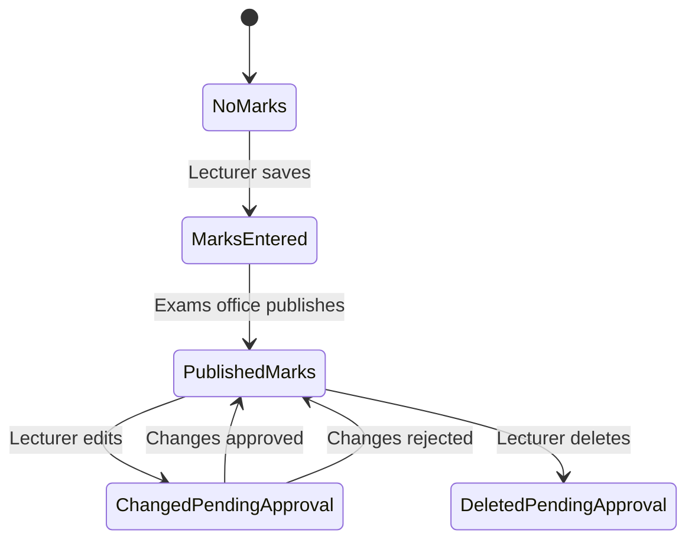

# Results module — legacy ARMS (`armsv2/Views/Result`)

**Source:** `C:\Users\JOSH\Desktop\New folder (3)\Active Solution\armsv2\Views\Result`  
**Database:** `arms_v2` — core table `student_course`  
**NDU policy (agreed):** single **CA /40** (combined test+coursework), **exam /100**, sit if **CA ≥ 17.5**, `final = ca + 0.6×exam`, pass **≥ 50**.

---

## 1. Staff menu — Results category

From `_LayoutStaff.cshtml`:

| Menu item | Entry view | Purpose |
|-----------|------------|---------|
| **Import** | `Import` → `ImportStepTwo` → `ImportStepThree` | Bulk upload CA + exam from Excel |
| **Academic Board** | `AcademicBoard` → `AcademicBoardResult` | Board report: all courses × students, GPA/CGPA/award |
| **Progression** | `Progression` → `ProgressionStudents` → `StudentProgressionResult` | **Main marks entry** per student / cohort |
| **Publish** | `PublishResults` → `PublishResult` / `PublishStudentCourses` | Official release to students |
| **Changes** | `Changes` → `ApprovalDetail` | Approve/reject edits after publish |
| **Purge Uploads** | `PurgeUploads` | Clean bad import batches |
| **CGPA Calculations** | `Formula` → `AddResultCalculation` / `EditResultCalculation` | Year-weight rules for degree CGPA |

**Policy config (separate folder):** `Semester/` — grading scheme, pass marks, award classification, semester deadlines — see **`SEMESTER_LEGACY_ARMS.md`**.

**Student menu:** `Result/StudentResults` — semester results (published view).

---

## 2. Per-course mark model (UI)

### Display columns (`_SemesterResultDetail.cshtml` — staff)

| Column | Field | Notes |
|--------|-------|-------|
| CA | `ContinousAssessment` | **/40** |
| Exam Mark | `ExamMark` | **/100** |
| Total Mark | `FinalMark` | Computed |
| GP | `CourseScoreSummary.GradePoint` | From grading schema |
| Remark | `CourseRemark` | e.g. pass/fail text, eligibility |

**Special courses:** `Course.IsSpecial` — CA/exam/final hidden (dissertation, etc.).

**Student view** (`_StudentSemesterResultDetail.cshtml`): often shows **Total + Grade + Remark** only (CA/exam columns commented out).

### Entry forms

| View | Who | Fields |
|------|-----|--------|
| `_EditStudentCourse.cshtml` | Staff (modal from progression) | `ContinousAssessment`, `ExaminationMark`; reason if already publishable |
| `AddStudentCourse.cshtml` | Staff | Add course to student + CA + exam + academic year/semester |
| `Import` + steps | Staff | Excel: reg no, **CA column**, **exam column** |

---

## 3. Result status workflow

From `_SemesterResultDetail` labels and `Changes.cshtml`:

| Status | UI hint |
|--------|---------|
| `NoMarks` / `MarksEntered` | *(Pending Publish)* or *(Pending Approval)* if exemption pending |
| `PublishedMarks` | Official; student sees in `StudentResults` |
| `ChangedPendingApproval` / `DeletedPendingApproval` | *(Pending Approval)* → **Changes** queue |

**Publish tables:** `published_result` (`isPublished`, `publishedBy`, `publishedOn`).

**Post-publish edits:** `result_approval` — old/new CA, exam, final (`ApprovalDetail.cshtml`).

---

## 4. Key workflows (by screen)

### A. Progression — primary marks entry

1. **Progression** — filter: academic year, faculty/campus/programme (`_ProgressionForm`).
2. **ProgressionStudents** — cohort list: reg no, CTCUs, CGPA, progression status, remark; PDF export.
3. **StudentProgressionResult** — one student:
   - Summary: CTCUs, GPA, CGPA, award, remark, min graduation load.
   - Tabs: Year 1…N → Semester 1 & 2 → `_SemesterResultDetail`.
   - Buttons: **Edit** (single row → `_EditStudentCourse` AJAX), **Delete** (bulk, needs approval if published), **Add course**, print provisional results / transcript.

Permission: `ServiceDetail.EditResults`, `StudentResults`, `Transcript`.

### B. Publish

1. **PublishResults** — filter programme + academic year when course was done.
2. **PublishResult** — tabs **Pending** / **Published**; list by campus, programme, course, semester; counts pending vs published; bulk **Publish**.
3. **PublishStudentCourses** — per course table: reg no, CA, exam, final; checkbox bulk publish.

Permission: `ServiceDetail.PublishResults`.

### C. Changes (after publish)

1. **Changes** — pending queue: reg no, course, Edit/Delete action, old vs new final mark.
2. **ApprovalDetail** — side-by-side old/new **Continuous Assessment**, **Examination Mark**, **Final Mark**; approve/reject + reason.

Permission: `ServiceDetail.Changes`.

### D. Import

1. **Import** — pick course, academic year, semester, upload spreadsheet.
2. **ImportStepTwo** — map Excel columns: reg no, **CA**, **exam** (row range).
3. **ImportStepThree** — confirm import.

Permission: `ServiceDetail.Import`.

### E. Academic Board

1. **AcademicBoard** — programme, year, intake type, first seating only, include sem 1 options.
2. **AcademicBoardResult** — wide grid: each course → score, grade, GP; student CTCUs, GPA, CGPA, award, remarks; CSV export.

### F. CGPA calculations

1. **Formula** — per award type + programme duration (2–5 year tabs).
2. **AddResultCalculation** / **EditResultCalculation** — start/end academic year, **year 1–N percentage contributions** to final CGPA (must sum sensibly; no overlap).

Feeds graduation **Qualified** lists and `student.currentCGPA`.

### G. Student-facing

1. **StudentResults** — same year/semester tabs as staff but `_StudentSemesterResultDetail` (redacted CA/exam optional).
2. PDF: provisional results / transcript (permission-gated).

---

## 5. Performance tracks (edge cases)

From result rows + registration views:

| `PerformanceTrack` | Effect on results |
|--------------------|-------------------|
| Normal | Standard CA/exam/final |
| Exempt pending / rejected / exempted | Blocks selection; different approval path |
| Credit transfer pending / rejected / credit | Transferred courses |

NDU portal: align with `StudentCourseUnitEnrollment.source` (`exempted`, `transferred`, etc.).

---

## 6. Aggregates shown everywhere

| Metric | Where computed | Shown on |
|--------|----------------|----------|
| **GPA** | Semester published courses | Progression, academic board |
| **CGPA** | Cumulative + year weights | Progression, graduation qualified |
| **CTCUs** | Sum credit units passed | Same |
| **Award** | Class of degree from CGPA rules | Progression, graduation |
| **Remark** | Progression decision text | Semester summary |

Cached on `student`: `currentCGPA`, `currentCTCU`, `currentAward` (after publish — see `GraduationModule` SQL).

---

## 7. Map to NDU `examinations` app (phases)

| ARMS feature | NDU phase | Horizon / API |
|--------------|-----------|---------------|
| `_EditStudentCourse` (CA + exam) | **Phase 1** | Lecturer **Enter scores** |
| Eligibility `HasNoProblem` / CA ≥ 17.5 | **Phase 1** | Block exam field in API |
| `PublishResult` / `published_result` | **Phase 1–2** | Exams office publish |
| `Changes` / `result_approval` | **Phase 2** | Post-publish audit |
| `Import` Excel | **Phase 2** | Bulk upload |
| `StudentResults` | **Phase 1** | Student **Results** page |
| `ProgressionStudents` | **Phase 3** | Admin cohort results |
| `AcademicBoardResult` | **Phase 3** | Board export |
| `Formula` CGPA weights | **Phase 3** | `CgpaPolicy` model |
| `Semester/GradingScheme` | **Phase 1** | `GradeScale` |
| `PrintStudentTranscript` | **Phase 4** | PDF service |

**Table mapping:**

| ARMS | NDU |
|------|-----|
| `student_course` | `StudentCourseUnitEnrollment` + `CourseUnitResult` |
| `ContinousAssessment` | `ca_mark` (0–40) |
| `ExamMark` | `exam_mark` (0–100) |
| `FinalMark` | `final_mark` |
| `ResultStatus` | `result_status` enum |
| `published_result` | `ResultPublication` |
| `result_approval` | `ResultChangeRequest` |

---

## 8. Files in this folder (quick index)

| File | Role |
|------|------|
| `StudentProgressionResult.cshtml` | Staff student results hub |
| `_SemesterResultDetail.cshtml` | Semester marks grid (staff) |
| `_StudentSemesterResultDetail.cshtml` | Semester grid (student) |
| `_EditStudentCourse.cshtml` | Edit CA + exam modal |
| `AddStudentCourse.cshtml` | Add course + marks |
| `PublishResult.cshtml` | Publish dashboard |
| `PublishStudentCourses.cshtml` | Bulk publish per course |
| `PublishResults.cshtml` | Publish filter |
| `Changes.cshtml` | Approval queue |
| `ApprovalDetail.cshtml` | Approve one change |
| `Import*.cshtml` | Excel import wizard |
| `Progression*.cshtml` | Cohort progression |
| `AcademicBoard*.cshtml` | Board report |
| `Formula.cshtml`, `*ResultCalculation.cshtml` | CGPA year weights |
| `StudentResults.cshtml` | Student portal |

**JS:** `Scripts/custom/results.js` — publish, purge, changes approve/reject, edit/delete student courses.

---

## 9. Related docs

- `EXAM_MODULE_PLAN.md` — NDU build plan  
- `EXAM_LOGIC_COMPARISON.md` — ARMS vs ERPs vs portal  
- `GRADUATION_LEGACY_ARMS.md` — graduation (downstream of publish)

---

## 10. Document history

| Date | Note |
|------|------|
| 2026-05-20 | Full map from `armsv2/Views/Result` |
