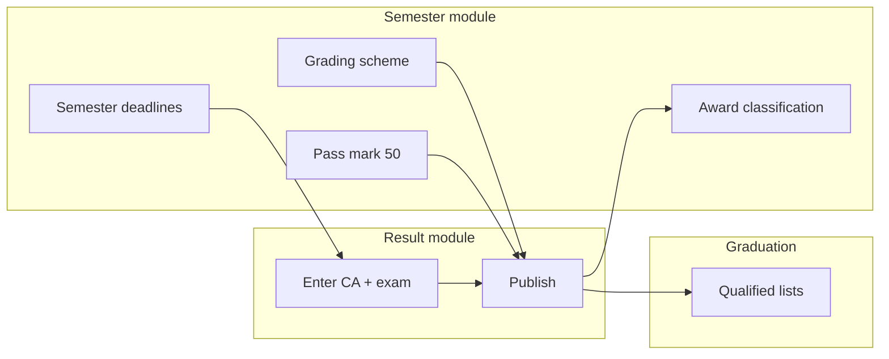

# Semester / policy configuration — legacy ARMS (`armsv2/Views/Semester`)

**Source:** `C:\Users\JOSH\Desktop\New folder (3)\Active Solution\armsv2\Views\Semester`  
**Role:** **Policy and calendar** for examinations — not mark entry (that is `Result/`).  
**Database:** `grading_scheme`, `grading_schema`, semester config tables, pass marks, award classification, regulations content.

---

## 1. Staff menu — Semester category

From `_LayoutStaff.cshtml`:

| Menu item | Action | Purpose |
|-----------|--------|---------|
| **Configuration** | `Semester/Index` | Academic **semesters**: start/end, registration deadline, **results upload deadline** |
| **Grading Scheme** | `Semester/GradingScheme` | Letter grades + mark ranges + **grade points** per award type |
| **Award Classification** | `Semester/AwardClassification` | Degree class from **CGPA** bands (First Class, etc.) |
| **Pass Marks** | `Semester/PassMarks` | Minimum **pass mark** (of 100) per award type + academic year range |
| **Regulations and Procedures** | `Semester/RegulationsAndProcedures` | Senate/regulations CMS cards |

**Student menu** (read-only policy):

| Item | Action |
|------|--------|
| Grading Scheme | `StudentsGradingScheme` — grade table + exam conduct text |
| Regulations | `RegulationsAndProcedures` |
| Pass Marks | `PassMarks` |

---

## 2. Semester configuration (academic calendar)

**Views:** `Index.cshtml` → partial `Display/_ViewSemesterConfiguration.cshtml`, `AddorEdit.cshtml`

| Field (per semester row) | Use |
|--------------------------|-----|
| Academic year | Groups semesters |
| Start date / End date | Teaching period |
| Registration deadline | Registration cut-off |
| **Results upload deadline** | When lecturers must finish uploading marks |

**NDU mapping:** Align with portal `Programs.Semester` (or academic calendar on `ProgramBatch`) + optional `results_upload_deadline` field for exams module reminders.

---

## 3. Grading scheme (letter grades & GP)

**Tables:** `grading_scheme` (parent: award type + start/end academic year) → `grading_schema` (rows: letter, startMark, endMark, gradePoint).

### Staff workflow

1. **GradingScheme** — tabs per **award type** (Diploma, Bachelor, …); shows **active** scheme (end year null = “To Date”).
2. **AddOrEditGradingScheme** — pick start/end academic year; saving **recalculates student results** (slow operation — noted in UI).
3. **ViewGradingScheme** — list grades; add/edit/delete grade rows.
4. **AddOrEditGrade** — `GradeLetter`, `StartMark`, `EndMark`, `GradePoint` (marks out of **100**).

**Rules in UI:**

- Each course graded out of **100** (`StudentsGradingScheme`: “maximum of 100 marks”).
- If scheme affects **graduates**, grade rows are **locked** (`ViewGradingScheme`: “can't be edited because it affects graduates”).
- Grade point: one decimal place.

### Student view

**StudentsGradingScheme** — tabs:

- **Grading of Course** — mark % bands → grade point → letter.
- **Conduct of Exams** — GPA/CGPA formulas (images), absence rules, core/elective definitions, Senate approval text, appeals, board of examiners.

**NDU mapping:**

| ARMS | NDU `examinations` |
|------|---------------------|
| `grading_scheme` | `GradeScale` (award type + effective years) |
| `grading_schema` | `GradeBand` (letter, min_mark, max_mark, grade_point) |
| Lookup on `final_mark` | After `ca + 0.6×exam` computed |

---

## 4. Pass marks

**Views:** `passmarks.cshtml`, `AddOrEditPassmark.cshtml`

| Field | Meaning |
|-------|---------|
| Award type | Diploma / Bachelor / … |
| Start / end academic year | Effective period |
| **PassMark** | Minimum total mark to pass (typically **50**) |

Add/edit links were **commented out** in UI (“when graduates and result recalculation is considered”) — values are mostly **read-only** display.

**NDU mapping:** `AssessmentPolicy.pass_mark` default **50** (already agreed); optional per award type / intake.

---

## 5. Award classification (degree class)

**Views:** `AwardClassification.cshtml`, `AddOrEditAwardClassification.cshtml`

| Column | Meaning |
|--------|---------|
| Academic year | Effective year |
| Award | e.g. First Class, Second Class Upper |
| Start CGPA / End CGPA | Band on cumulative GPA |

Used for `student.currentAward` and graduation qualified lists.

**NDU mapping:** `DegreeClassification` model (Phase 3), fed from computed CGPA.

---

## 6. Regulations and procedures

**Views:** `RegulationsAndProcedures.cshtml`, `AddorEditRegulation.cshtml`, `ContentView.cshtml`

CMS-style **title + HTML content** cards (“University Procedures and Regulations”). Staff edit; students read.

Topics in **Conduct of Exams** (student grading page) include: absence = F, justified absence = ABS, Faculty Board approval, publication, appeals.

**NDU mapping:** Optional CMS in portal or static PDF links; not blocking Phase 1 marks.

---

## 7. How Semester connects to Result & Graduation

| Step | Module |
|------|--------|
| Lecturer deadline | **Semester** `Results upload deadline` |
| Enter CA/40 + exam/100 | **Result** Progression |
| `final_mark` + letter + GP | **Result** uses **Grading scheme** |
| Pass/fail | **Pass mark** + course rules |
| CGPA + class | **Result** Formula + **Award classification** |
| Graduate | **Graduation** |

**CA ≥ 17.5 sit rule** is **not** in Semester views — enforced in Result backend (`HasNoProblem`); NDU puts it in `AssessmentPolicy.min_ca_to_sit_exam`.

---

## 8. NDU portal build phases

| ARMS Semester feature | Phase |
|----------------------|-------|
| Grading scheme + grades | **Phase 1** (`GradeScale` / `GradeBand`) |
| Pass mark 50 | **Phase 1** (`AssessmentPolicy.pass_mark`) |
| Results upload deadline | **Phase 2** (on `Semester` or batch) |
| Award classification | **Phase 3** (with CGPA) |
| Regulations CMS | **Later** (content) |
| Student policy pages | **Phase 2** (read-only API for Horizon) |

---

## 9. File index

| File | Role |
|------|------|
| `Index.cshtml`, `Display/_ViewSemesterConfiguration.cshtml` | List semesters + deadlines |
| `AddorEdit.cshtml`, `create.cshtml` | Edit semester |
| `GradingScheme.cshtml` | Staff grade tables by award type |
| `ViewGradingScheme.cshtml`, `AddOrEditGradingScheme.cshtml` | One scheme CRUD |
| `AddOrEditGrade.cshtml` | One grade band |
| `StudentsGradingScheme.cshtml` | Student policy + GPA/CGPA help |
| `passmarks.cshtml`, `AddOrEditPassmark.cshtml` | Pass thresholds |
| `AwardClassification.cshtml`, `AddOrEditAwardClassification.cshtml` | Degree classes |
| `RegulationsAndProcedures.cshtml`, `AddorEditRegulation.cshtml` | Regulations CMS |

---

## 10. Related docs

- `RESULT_LEGACY_ARMS.md` — marks entry & publish  
- `GRADUATION_LEGACY_ARMS.md` — ceremonies  
- `EXAM_MODULE_PLAN.md` — NDU build plan  

---

## 11. Document history

| Date | Note |
|------|------|
| 2026-05-20 | Documented from `armsv2/Views/Semester` |
